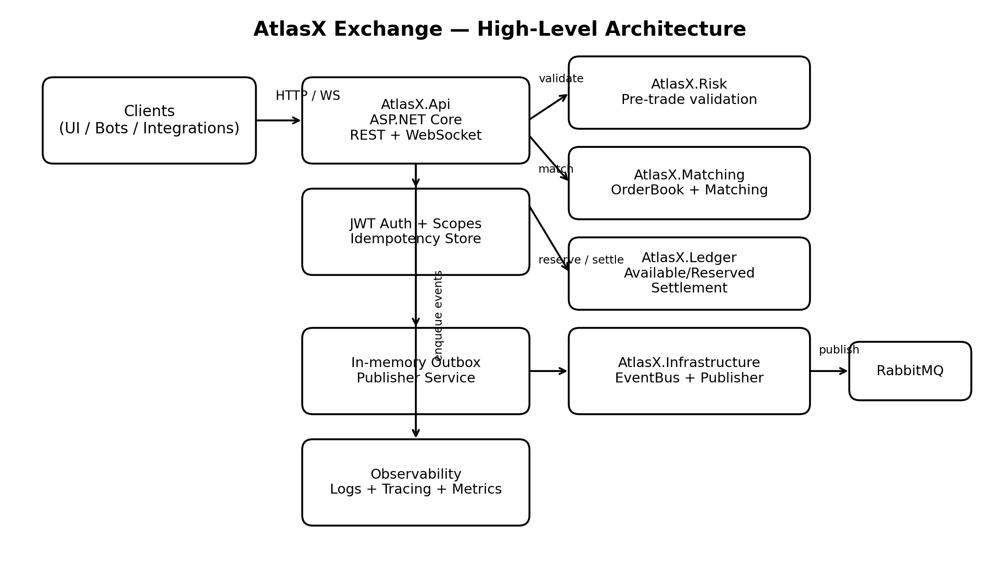
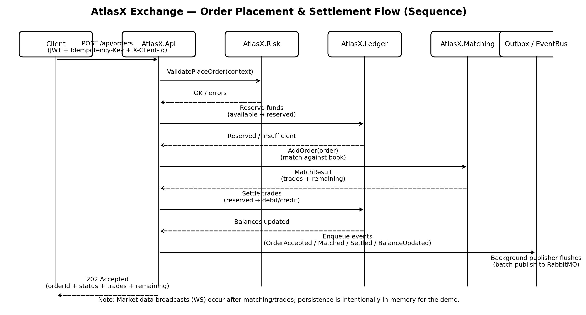

# AtlasX Exchange (Demo Project)

AtlasX is a **demo cryptocurrency exchange backend** built to demonstrate
**exchange-core fundamentals** and **production-grade backend engineering**
commonly required in crypto and fintech platforms.

The project focuses on **correctness, determinism, and system design**
rather than UI or commercial features.

---

## 🎯 Purpose

This project was built to showcase how a modern cryptocurrency exchange core
can be designed and implemented, including:

- Order matching with price-time priority
- Pre-trade risk validation
- Wallet & balance management with reserved funds
- Event-driven workflows
- Real-time market data delivery
- Security fundamentals (JWT, idempotency)

---

## 🧠 Core Features

### Trading & Matching
- REST-based Order API
- In-memory **price-time priority matching engine**
- Partial fills and multi-level price matching
- Deterministic trade execution

### Risk Management
- Pre-trade validation (limits, price bands)
- Client-based rate limiting
- Idempotent order submission

### Wallet & Ledger
- In-memory **double-entry style ledger**
- Available / Reserved balance separation
- Trade settlement logic
- Deposit & balance endpoints

### Real-time & Events
- WebSocket market data feed (order book snapshots & trades)
- Domain events with reliable in-memory outbox (leasing + retries)
- RabbitMQ publisher (graceful fallback if unavailable)

### Observability & Security
- Structured logging
- OpenTelemetry tracing & metrics
- JWT-based authentication with scope-based authorization
- Idempotency handling for order requests
- Idempotency retention with TTL and capacity limits

---
## Architecture Diagram



## Order Flow Diagram



## 🚀 Quick Demo (End-to-End)

This section demonstrates a minimal end-to-end trading flow using the REST API.
The goal is to show how **risk checks, matching, ledger settlement, events, and idempotency**
work together in a realistic exchange scenario.

### Prerequisites
- Docker & Docker Compose running
- API started locally
- A valid JWT token with scopes `trade wallet`
- A client identifier header (`X-Client-Id`)

---

### 1️⃣ Deposit Funds

Deposit quote currency (USD) for the buyer and base currency (BTC) for the seller.

```bash
curl -X POST http://localhost:5000/api/wallets/deposit \
  -H "Authorization: Bearer <JWT_TOKEN>" \
  -H "X-Client-Id: buyer-1" \
  -H "Content-Type: application/json" \
  -d '{ "asset": "USD", "amount": 50000 }'

curl -X POST http://localhost:5000/api/wallets/deposit \
  -H "Authorization: Bearer <JWT_TOKEN>" \
  -H "X-Client-Id: seller-1" \
  -H "Content-Type: application/json" \
  -d '{ "asset": "BTC", "amount": 1.0 }'
```
## 2️⃣ Place a SELL Limit Order (Maker)
```bash
curl -X POST http://localhost:5000/api/orders \
  -H "Authorization: Bearer <JWT_TOKEN>" \
  -H "X-Client-Id: seller-1" \
  -H "Idempotency-Key: sell-order-1" \
  -H "Content-Type: application/json" \
  -d '{
    "symbol": "BTC-USD",
    "side": "SELL",
    "type": "LIMIT",
    "quantity": 0.5,
    "price": 42000
  }'
```
**Expected result:**
- Order is accepted
- Funds are moved from available → reserved
- Order rests on the order book

## 3️⃣ Place a BUY Limit Order (Taker)
```bash
curl -X POST http://localhost:5000/api/orders \
  -H "Authorization: Bearer <JWT_TOKEN>" \
  -H "X-Client-Id: buyer-1" \
  -H "Idempotency-Key: buy-order-1" \
  -H "Content-Type: application/json" \
  -d '{
    "symbol": "BTC-USD",
    "side": "BUY",
    "type": "LIMIT",
    "quantity": 0.5,
    "price": 42000
  }'
```
**Expected result:**
- Orders are matched using price-time priority
- Trade is executed at maker price
- Ledger settlement occurs:
  - Buyer: USD reserved → BTC credited
  - Seller: BTC reserved → USD credited
- Domain events are enqueued and published
- WebSocket clients receive trade updates

## 4️⃣ Check Wallet Balances
```bash
curl -X GET http://localhost:5000/api/wallets/balances \
  -H "Authorization: Bearer <JWT_TOKEN>" \
  -H "X-Client-Id: buyer-1"

curl -X GET http://localhost:5000/api/wallets/balances \
  -H "Authorization: Bearer <JWT_TOKEN>" \
  -H "X-Client-Id: seller-1"
```
**You should observe:**
- Correct available / reserved balances
- Settled trade reflected in both accounts

## 5️⃣ Idempotency Check (Optional)
```bash
curl -X POST http://localhost:5000/api/orders \
  -H "Authorization: Bearer <JWT_TOKEN>" \
  -H "X-Client-Id: buyer-1" \
  -H "Idempotency-Key: buy-order-1" \
  -H "Content-Type: application/json" \
  -d '{ ...same payload... }'
```
**Expected result:**
- Same response is returned
- No duplicate trades or balance changes occur

---

## 🛠 Tech Stack

- **.NET 8 / ASP.NET Core**
- PostgreSQL, Redis
- RabbitMQ
- Docker Compose
- xUnit (unit & integration tests)

---

## 🚀 Running the Project

```bash
docker compose up -d
dotnet run --project src/AtlasX.Api

```
### Configuration Notes

This demo repository ships with safe default configuration values
for idempotency, outbox, and RabbitMQ behavior.

Environment-specific settings such as RabbitMQ host, credentials,
or development overrides should be provided via:
- `appsettings.Development.json` (ignored by git), or
- environment variables.

No secrets are stored in this repository.

## Swagger UI:
http://localhost:5000/swagger

## 📡 WebSocket Market Data

Use wscat to connect and receive order book snapshots and trades:
wscat -c ws://localhost:5000/ws/market?symbol=BTC-USD

## 🔐 Development JWT Token

Generate a development JWT token with scopes trade and wallet
using PowerShell:
```bash
$secret = "atlasx-dev-secret-key-please-change"
$header = @{ alg = "HS256"; typ = "JWT" } | ConvertTo-Json -Compress
$payload = @{
  sub = "demo-client"
  scope = "trade wallet"
  exp = [int][DateTimeOffset]::UtcNow.AddHours(1).ToUnixTimeSeconds()
} | ConvertTo-Json -Compress

function Base64Url([string]$text) {
  [Convert]::ToBase64String([Text.Encoding]::UTF8.GetBytes($text)).TrimEnd("=") `
    -replace "\+","-" -replace "/","_"
}

$unsigned = "$(Base64Url $header).$(Base64Url $payload)"
$hmac = New-Object System.Security.Cryptography.HMACSHA256 `
  ([Text.Encoding]::UTF8.GetBytes($secret))
$sig = [Convert]::ToBase64String(
  $hmac.ComputeHash([Text.Encoding]::UTF8.GetBytes($unsigned))
).TrimEnd("=") -replace "\+","-" -replace "/","_"

"$unsigned.$sig"
```
## ⚠️ Disclaimer

This project is for educational and demonstration purposes only.
It is not production-ready and omits persistence, regulatory compliance,
and security hardening required for a real exchange.

## 📌 Why AtlasX?

AtlasX demonstrates how to think and design exchange systems,
not just how to implement APIs.
The emphasis is on system boundaries, correctness, and extensibility.
